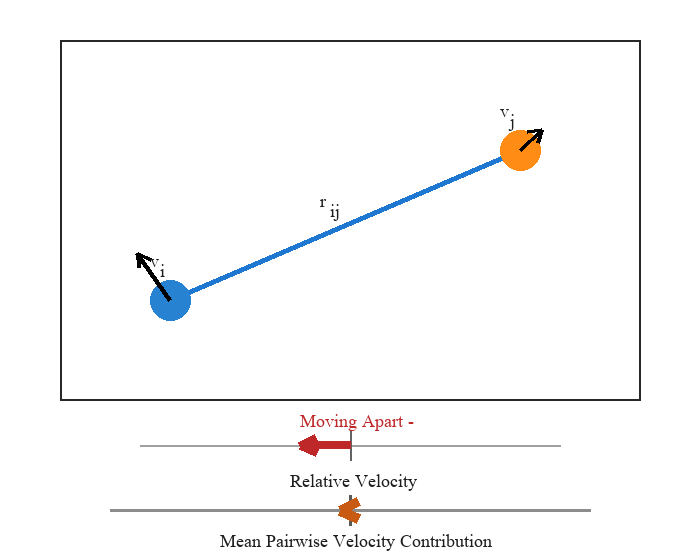
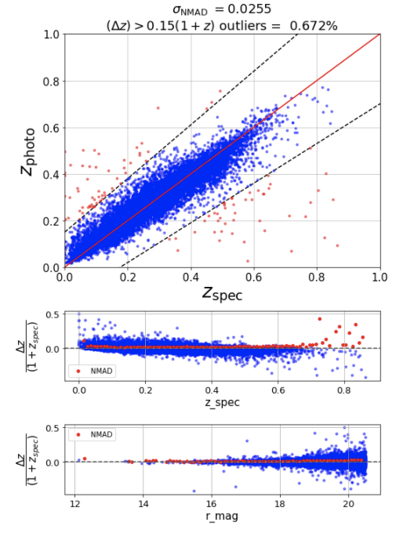
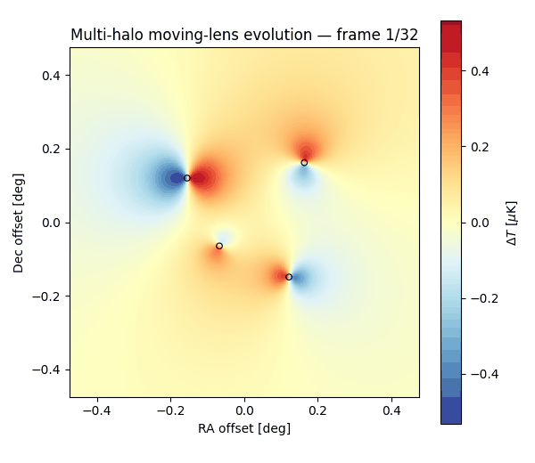

# Hi, I'm Ali 👋

I'm a **Physics PhD researcher at the University of Pittsburgh** studying **cosmology using statistical inference, machine learning, large-scale data analysis, and scientific computing**.

My work focuses on extracting weak signals from noisy datasets using **predictive modeling, simulation, uncertainty quantification, and high-performance computing**.

## Featured Projects

### 🔭 [Moving Lens Analysis Pipeline](https://github.com/ali-beheshti/moving-lens-analysis-pipeline)

End-to-end pipeline for statistical signal extraction from large CMB and galaxy datasets.

`Statistical inference` · `Signal processing` · `Large-scale data` · `HPC` · `Python`

  

<table>
<tr>
<td width="60%" valign="top">

### 🔭 [Moving Lens Analysis Pipeline](https://github.com/ali-beheshti/moving-lens-analysis-pipeline)

End-to-end pipeline for statistical signal extraction from large CMB and galaxy datasets.

`Statistical inference` · `Signal processing` · `Large-scale data` · `HPC` · `Python`

</td>
<td width="40%" align="center">

</td>
</tr>
</table>

### 📊 [Photo-z Machine Learning Benchmark](https://github.com/ali-beheshti/photo-z-machine-learning-benchmark)

Benchmarking machine-learning regression models for predicting galaxy redshifts from observational features.

`Machine learning` · `Regression` · `Model comparison` · `Feature analysis` · `scikit-learn`

  

### 🌌 [Fast Signal Painter](https://github.com/ali-beheshti/flat-signal-painter)

Framework for efficiently generating and visualizing simulated astrophysical signals on flat-sky maps.

`Simulation` · `Numerical methods` · `Scientific Python` · `Visualization`

  

## Skills

**Python · SQL · C · NumPy · SciPy · pandas · scikit-learn · PyTorch · Statistical inference · Machine learning · Monte Carlo methods · HPC · SLURM · Git**

Although my research applications come from cosmology, much of the underlying work is domain-independent:

- extracting weak signals from noisy data
- designing and validating statistical estimators
- working with large, high-dimensional datasets
- building reproducible computational pipelines
- modeling uncertainty and testing model assumptions
- optimizing scientific code for HPC environments
- translating mathematical models into working analysis software

I'm particularly interested in problems where **statistics, computation, and physical or quantitative modeling meet**.

## Connect

[LinkedIn](PASTE_LINKEDIN_URL_HERE) · [ORCID](PASTE_ORCID_URL_HERE)
