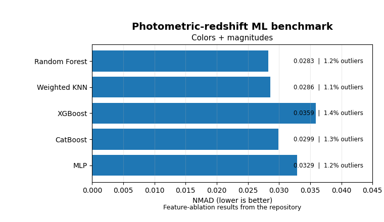

# Hi, I'm Ali 👋

I'm a **Physics PhD researcher** at the University of Pittsburgh working at the intersection of **physics, statistics, and scientific computing**.

My research focuses on extracting weak signals from large, noisy datasets through **statistical modeling, simulation, machine learning, and high-performance computing**.

## Featured Projects

<table>
<tr>
<td width="60%" valign="top">

### 🔭 [Moving Lens Analysis Pipeline](https://github.com/ali-beheshti/moving-lens-analysis-pipeline)

End-to-end pipeline for statistical signal extraction from large CMB and galaxy datasets.

`Statistical inference` · `Signal processing` · `Large-scale data` · `HPC` · `Python`

</td>
<td width="40%" align="center">

</td>
</tr>
</table>

<table>
<tr>
<td width="60%" valign="top">

### 📊 [Photo-z Machine Learning Benchmark](https://github.com/ali-beheshti/photo-z-machine-learning-benchmark)

Benchmarking machine-learning regression models for predicting galaxy redshifts from observational features.

`Machine learning` · `Regression` · `Model comparison` · `Feature analysis` · `scikit-learn`

</td>
<td width="40%" align="center">

</td>
</tr>
</table>

<table>
<tr>
<td width="60%" valign="top">

### 🌌 [Fast Signal Painter](https://github.com/ali-beheshti/flat-signal-painter)

Framework for efficiently generating and visualizing simulated astrophysical signals on flat-sky maps.

`Simulation` · `Numerical methods` · `Scientific Python` · `Visualization`

</td>
<td width="40%" align="center">

</td>
</tr>
</table>

## ⚡ Technical Toolkit

<table>
<tr>
<td width="50%" valign="top">

### 💻 Build
`Python` · `SQL` · `C`  
`NumPy` · `pandas` · `SciPy`

</td>
<td width="50%" valign="top">

### 🤖 Model
`scikit-learn` · `XGBoost` · `CatBoost`  
`PyTorch` · `Feature Engineering` · `Model Validation`

</td>
</tr>

<tr>
<td width="50%" valign="top">

### 📐 Infer
`Statistical Inference` · `Hypothesis Testing`  
`Uncertainty Quantification` · `Monte Carlo`  
`Covariance Modeling`

</td>
<td width="50%" valign="top">

### ⚙️ Scale
`HPC` · `SLURM` · `Linux` · `Bash`  
`Git` · `Jupyter` · `Matplotlib`

</td>
</tr>
</table>

---

## 🧩 What I Like Working On

<table>
<tr>
<td width="33%" valign="top">

### 📡 Signal
Extracting **weak signals** from noisy, complex datasets.

</td>
<td width="33%" valign="top">

### 📊 Models
Building and validating **statistical and predictive models**.

</td>
<td width="33%" valign="top">

### 🚀 Scale
Turning analyses into **reproducible HPC workflows**.

</td>
</tr>

<tr>
<td width="33%" valign="top">

### 🎲 Uncertainty
Quantifying **uncertainty, bias, and robustness**.

</td>
<td width="33%" valign="top">

### 🧠 Data
Working with **large, high-dimensional datasets**.

</td>
<td width="33%" valign="top">

### 🧮 Translation
Turning **mathematical ideas into working software**.

</td>
</tr>
</table>

> **Statistics × Computation × Quantitative Modeling**  
> I’m especially interested in problems that sit at the intersection of all three.
---

### Find me elsewhere

